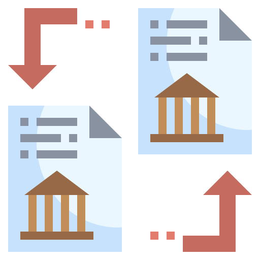

 

  

  <h3 align="center">File Sharing Distributed System</h3>

  

    A prototype application that allows users to upload files to a server, and download
them again while maintaining data replication over multiple machines
  

## Table of Contents

- [About the Project](#about-the-project)
  - [The Architecture](#the-architecture)
  - [Data Keepers Status Tracking](#data-keepers-status-tracking)
  - [Master Tracker](#master-tracker)
  - [Data Keeper Nodes](#data-keeper-nodes)
  - [File Upload Protocol](#file-upload-protocol)
  - [N-Replicates Protocol](#n-replicates-protocol)
  - [File Download Protocol](#file-download-protocol)
  - [Built With](#built-with)
- [Prerequisites](#prerequisites)
- [Running](#running)
- [Contributors](#contributors)

## About The Project

![System Structure][system-architecture]

### Architecture

- This is a centralized distributed system. It has 2 types of machine nodes. First, the Master Tracker node. This node has look-up tables to keep track of stored files, data keepers status and data keepers available ports. Second, the Data Keeper nodes. Data Keeper nodes are the actual nodes that have the data files.

### Data Keepers Status Tracking

- [Publisher - Subscriber](https://learning-0mq-with-pyzmq.readthedocs.io/en/latest/pyzmq/patterns/pubsub.html) messaging pattern is used to implement this functionality. Every 1 second, each data keeper node sends an online status confirmation message to the master tracker node. The master tracker node then update the look-up table mentioned above. If one of the data keeper nodes are down it will change the corresponding cell in the respective look-up table.

### Master Tracker

- The master tracker node is a multithreaded module that runs on a single machine. Usually there are 3 threads doing the tracker job by handling the clients' requests concurrently. The look-up tables are shared across the master node threads. Also, every thread listens on a different port on the same machine.

### Data Keeper Nodes

- Each data keeper node is a multiprocess module that runs on a single machine. Usually there are 3 processes doing the data keeper job by sending or receiving files concurrently. Every process listens on a different port on the same machine.

### File Upload Protocol

For a client to upload a file to a cluster, the following protocol is followed:

1. A client process communicates with the master tracker node threads.
2. The master tracker responds with an available port number of one of the data keeper nodes.
3. The client then constructs a communication with this port, and transfers the file to it.
4. When the transferring procedure is finished, the data keeper node notifies the master tracker.
5. The master tracker then add the file record to the respective look-up table.
6. The master notifies the client with a successful message.
7. The master chooses N-1 other nodes to replicate the file transferred. The protocol of this statement is explained in the [N-Replicates Protocol](#n-replicates-protocol) section

### N-Replicates Protocol

- This procedure runs on the master tracker machine. This procedure periodically checks whether each recorded file is available on at least N data keeper nodes, if not, it replicates the file by directing a connection through which the owner node sends the file to other N-1 nodes that don't have such file stored.

### File Download Protocol

For a client to download a file to a cluster, the following protocol is followed:

1. A client process communicates with the master tracker node threads.
2. The master tracker responds with an available port number of one of the data keeper nodes that has the requested file.
3. The client then constructs a communication with this port, and downloads the file from it.
4. When the transferring procedure is finished, The data keeper node notifies the master tracker.

### Built With

- [Python](https://www.python.org/)
- [PyZMQ](https://pyzmq.readthedocs.io/en/latest/)

## Prerequisites

- Download and install Python using this [link](https://www.python.org/downloads/)
- Install pip package manager using this [link](https://pip.pypa.io/en/stable/installing/)
- Install the virtualenv package using `pip install virtualenv`
- Create a virtual environment inside the project directory by running `virtualenv venv`
- Activate the virtual environment
    - Windows: `venv\Scripts\activate`
    - Linux/OSX: `source venv/bin/activate`
- Install PyZMQ by running this command `pip install pyzmq`

## Running

- To run a client instance: `python ClientPC.py`
- To run a Data Keeper instance: `python DatakeeperPC.py`
- To run a Master instance: `python Master.py`
- Enter the IP of each respective instance (without `tcp://`)

## Contributors

* [Khaled Amgad](https://github.com/KhaledAmgad)
* [Mahmoud Mohamad](https://github.com/mmmacmp)
* [Muhanad Atef](https://github.com/Muhanad23)
* [Nader AbdAlGhani](https://github.com/naderabdalghani)

[system-architecture]: assets/system-architecture.png
